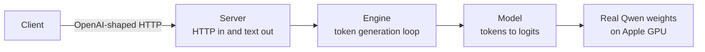

# TinyInfer Real Model V0

## Goal

Build the smallest honest inference server that runs a useful public model on Apple Silicon while keeping the inference implementation readable.

A clean checkout must be able to download `Qwen/Qwen2.5-1.5B-Instruct`, load its real tokenizer and safetensor weights, generate text through TinyInfer's own Qwen2 implementation, and expose that generation through a small OpenAI-compatible API.

## Product contract

- The import package lives directly at `tinyinfer/`; there is no `src/` directory.
- `tinyinfer download MODEL` fetches the required model files.
- `tinyinfer generate MODEL --prompt TEXT` runs real autoregressive generation locally.
- `tinyinfer serve MODEL` exposes a documented subset of `POST /v1/chat/completions`.
- `tinyinfer chat --host URL` talks to the server over HTTP and never imports the model.
- `tinyinfer bench MODEL` reports at least time to first token, inter-token latency, end-to-end latency, and output-token throughput.
- The runtime must not depend on Transformers, vLLM, SGLang, or llama.cpp for model execution or generation.
- Every optimization remains replaceable: the first implementation deliberately recomputes the full sequence for every token so a later KV-cache change is visible and measurable.

## Mental model

The dependency direction is one way: `server -> engine -> model`. Artifact downloading and tokenization are small helpers, not additional runtime layers.

## Technical decisions

- Python 3.11+ and PyTorch keep tensor operations inspectable. MPS is the first accelerator, with CPU retained for tiny tests.
- Qwen2.5-1.5B-Instruct is the first correctness model: it is small enough for the learner's 48 GB Apple Silicon machine and still exercises modern essentials such as RoPE and grouped-query attention.
- `huggingface-hub`, `tokenizers`, and `safetensors` handle transport and file formats only. TinyInfer owns the network architecture, forward pass, generation loop, sampling, and serving behavior.
- V0 uses eager, explicit attention and greedy decoding. KV caching, quantization, batching, FlashAttention, and alternate samplers are later measured changes.
- The model and tokenizer implementation target one named architecture first. Unsupported architectures fail clearly instead of being partially accepted.

## Implementation units

### U1 - Package, artifacts, and tokenizer

Create the flat package, CLI, Qwen config parser, snapshot downloader, safetensor shard discovery, raw tokenizer wrapper, and explicit ChatML prompt formatting.

Proof: unit tests use temporary config/tokenizer fixtures; a manual smoke downloads the named real model.

### U2 - Qwen2 forward pass

Implement embedding lookup, RMSNorm, rotary positions, grouped-query causal attention, gated SiLU MLP, residual decoder blocks, final normalization, and tied output projection. Load official Qwen weight names directly from one or more safetensor shards.

Proof: small randomly initialized configs test shape, causality, grouped-query head expansion, and tied logits. A real-model smoke proves all expected weights load.

### U3 - Autoregressive engine

Format a chat prompt, tokenize it, repeatedly run the model, greedily select one token, stop at EOS or the output limit, and decode incrementally. Record per-token timings.

Proof: `tinyinfer generate` produces coherent text from Qwen2.5-1.5B-Instruct on MPS. No fake generation path exists.

### U4 - HTTP server and remote client

Implement a narrow text-only chat-completions endpoint, including SSE streaming, and a standard-library remote chat client.

Proof: in-process contract tests plus a real localhost request use the same real Engine interface.

### U5 - Benchmark seam

Add a repeatable single-request benchmark command that separates prompt processing, first-token delay, inter-token gaps, total latency, and output throughput. Print configuration and percentile summaries.

Proof: a short benchmark emits machine-readable JSON and a human summary.

## Verification

- `python -m pytest -q`
- `python -m tinyinfer --help`
- `python -m tinyinfer download Qwen/Qwen2.5-1.5B-Instruct`
- `python -m tinyinfer generate Qwen/Qwen2.5-1.5B-Instruct --prompt "Explain what a KV cache saves in one sentence." --max-new-tokens 24`
- Start `tinyinfer serve`, then call it from `tinyinfer chat` in another shell.
- Run `tinyinfer bench` and retain the hardware/model/settings alongside results.

## Not in V0

Quantization, KV caching, continuous batching, paged attention, production authentication, CUDA, Linux deployment, multiple models, tensor parallelism, and full OpenAI compatibility. These remain the optimization curriculum built on top of a working real baseline.
